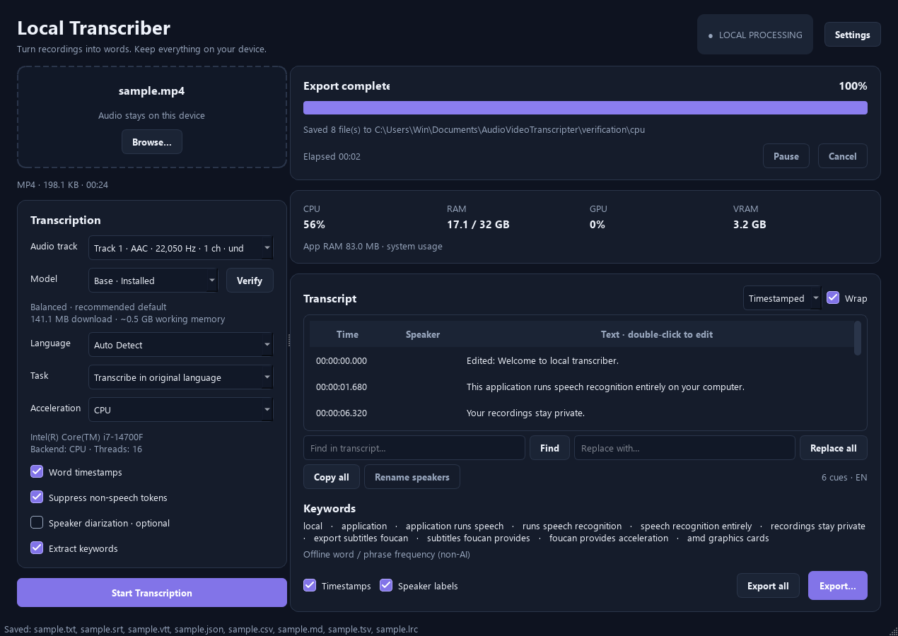
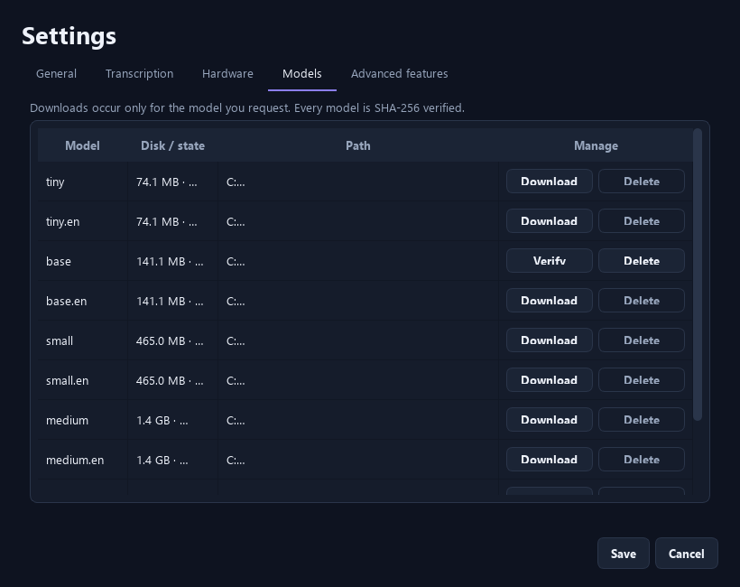

# Local Transcriber

A Windows-first PySide6 desktop app for private video and audio transcription with **whisper.cpp**. Media, audio, text, keywords and speaker information stay on your computer. There is no transcription API, account requirement for Whisper, or telemetry. The default model is **base**.

## Screenshots





These screenshots come from a real 22-second MP4 transcription, with base, word timestamps, offline keyword extraction and edited exports. See `verification/*/report.json` for reproducible run results. Generate new screenshots with `scripts/e2e.py`.

## Run the packaged application

Open **`LocalTranscriber.exe`** from any folder. The single-file Windows x64 build embeds Python, Qt, FFmpeg/ffprobe and CPU/Vulkan whisper.cpp runtimes. You do not need Python, FFmpeg on PATH or the source folder. Copy the executable alone to another Windows 11 x64 PC. GPU acceleration requires that PC's graphics driver; CUDA/HIP require additional built runtimes.

At startup the executable unpacks its runtime to a temporary directory and removes it on normal exit. This may take several seconds. Models and settings persist under `%LOCALAPPDATA%/LocalTranscriber`, independently of the executable's location. Models are not embedded: the selected model downloads on request, then works offline. On another PC, download or copy the models. Optional diarization/AI keywords still use a separately configured Python environment.

For source execution or directory builds without embedded tools, install FFmpeg and ffprobe and put them on PATH:

```powershell
winget install --id Gyan.FFmpeg --exact
```

Restart the app after changing PATH. No dependency downloads happen at startup.

## Run from source

Python **3.11 or newer**, preferably 3.12, is required. From the project folder:

```powershell
python -m venv .venv
.venv\Scripts\activate
pip install -r requirements.txt
python src/app.py
```

`run.bat` launches the virtual-environment GUI without a console. On Linux/macOS use `source .venv/bin/activate`. FFmpeg/ffprobe must be installed locally on every platform. The core dependencies do not include PyTorch, pyannote, KeyBERT or sentence-transformers.

Build a backend **once**, before using the source checkout. There is no compilation at application startup:

```powershell
python scripts/build_backend.py cpu
```

The script clones a pinned MIT-licensed whisper.cpp **v1.8.3** revision and builds our small C++ bridge. Windows builds require Visual Studio C++ Build Tools and a Windows SDK, with CMake/Ninja. The script discovers standard Visual Studio installations. Linux/macOS require CMake and a C++17 toolchain. CPU x64 builds assume AVX2; for older CPUs change the CMake AVX options and rebuild. ARM builds use the corresponding compiler/toolchain.

## Workflow

1. Drop a recording onto the input card or press **Browse**. Metadata is inspected in the background. Select an audio track if there are several.
2. Leave **Base** selected or choose another model. The selector displays installed/download state. Nothing is downloaded until **Start Transcription**, **Download**, or an explicit optional-model download.
3. Choose a language or **Auto Detect**, a task and acceleration. Auto uses a device reported by a compatible native runtime.
4. Start transcription. Genuine FFmpeg decode progress and Whisper inference callbacks update the interface. New segments appear as they are recognized. Cancel stops the child process tree and removes temporary files.
5. Edit cue text in **Timestamped** mode, or switch to the **Plain text** editor. Copy, search, replace all, word wrap and speaker renaming are available. Double-click a timestamp to edit its start/end seconds.
6. Export TXT, SRT, VTT, JSON, CSV, Markdown, TSV or LRC. Existing files require confirmation. The previous export folder is remembered.

The timestamp and speaker checkboxes affect textual exports; subtitles always retain timing, and structured JSON/CSV always preserve their timing fields. Word timestamps and confidence data are retained in JSON. Editing cue text clears stale word timing/confidence for that cue. Plain-text line additions inherit the surrounding cue timing; joining paragraphs joins the original cue intervals. For precise subtitle timing, use the timestamped cue editor. Renamed speakers appear in every subsequent export.

Exports do not write back to your source media. Transcripts are held in memory until exported; close/new-transcription dialogs protect unexported changes. Export JSON if you need a durable structured copy. A cancelled/failed run may retain its recognized cues, clearly marked as an incomplete result in JSON.

## Media formats

Video: MP4, MKV, MOV, AVI, WebM, M4V, MPEG/MPG. Audio: WAV, MP3, FLAC, M4A, AAC, OGG, Opus and WMA. Actual codec support depends on your FFmpeg build. Browse's “All files” option allows other FFmpeg-supported containers. Missing/corrupted files, absent audio, invalid tracks and decoder failures produce GUI errors and technical logs.

Normalization writes mono 16 kHz PCM16 WAV into an application cache directory. RF64 is supported for long files. The source video is never duplicated. The native bridge reads at most five minutes of PCM at once and seeks a quiet cut near each chunk boundary, reusing the loaded Whisper model and carrying the previous segment as a prompt. Speech can still straddle chunk boundaries; inspect the result for critical uses. The main GUI process does not hold decoded audio buffers. Core model resources are released when the child process exits.

## Models and storage

Available Whisper models:

| Selector | Download | Approximate working memory estimate |
|---|---:|---:|
| tiny / tiny.en | 74 MiB | 0.4 GiB |
| **base / base.en** | 141 MiB | 0.5 GiB |
| small / small.en | 465 MiB | 1.2 GiB |
| medium / medium.en | 1.43 GiB | 3.1 GiB |
| large (large-v3) | 2.88 GiB | 5.1 GiB |
| turbo (large-v3-turbo) | 1.51 GiB | 2.3 GiB |

Memory estimates are planning hints, not hard limits or guaranteed peak usage. Beam size, timestamps, backend and driver affect actual memory consumption. The app warns when an estimate exceeds currently reported free memory and lets you continue.

Models come from the [whisper.cpp model repository](https://huggingface.co/ggerganov/whisper.cpp), with size and SHA-256 values pinned in `src/transcription/catalog.json`. **Only base was downloaded for project verification.** The app never pre-downloads all models. Every model is hashed before use, even when offline. Corrupted or incomplete models cannot reach inference; a requested download repairs them after verification. Downloads use an atomic `.part` replacement; cancellation/failure removes the partial file. Download progress includes percentage, bytes, total and speed. Settings → Models offers Download/Verify and Delete; active models are protected.

The writable application directory is:

- Windows: `%LOCALAPPDATA%\LocalTranscriber\`
- Other platforms: the platform's user-data directory from platformdirs.

It contains `models/`, `cache/`, `backends/`, `logs/app.log` and `settings.json`. Set `LOCAL_TRANSCRIBER_HOME` to relocate the entire directory. Model files never live in the PyInstaller executable. The app takes a single-instance lock for this directory. Debug retention is opt-in; otherwise temporary jobs are removed on normal completion, cancellation and failures. A force kill/power loss can leave `cache/job-*` directories, which can be removed when the app is closed.

Whisper languages are generated from the pinned backend's full language table (100 entries); the UI does not limit languages to a few examples. `.en` models recognize English only. **Translate speech to English** uses Whisper's multilingual translation task; the app rejects English-only and Turbo models for that task. This is not arbitrary target-language translation. Automatic punctuation comes from Whisper; there is no separate punctuation download or misleading toggle. Non-speech token suppression is exposed explicitly; it is not promised to remove every filler word or hallucination.

## GPU acceleration

**CUDA is NVIDIA-specific. Vulkan is the practical cross-vendor GPU path, including AMD.** Each runtime probes ggml's actual devices; the GUI cannot claim GPU acceleration from the presence of a display adapter alone. Runtime identity/protocol mismatches, missing DLLs, failed probes and incompatible devices are unavailable. The native process verifies GPU initialization before inference. GPU execution errors are reported, with **Retry on CPU** where possible.

Backend layout (include dependent runtime DLLs beside each executable):

```text
backends/
    cpu/local-whisper.exe
    vulkan/local-whisper.exe
    cuda/local-whisper.exe
    hip/local-whisper.exe
```

Runtime search order: `LOCAL_TRANSCRIBER_BACKENDS`, writable application-data `backends/`, bundled `backends/`, then the packaged executable's sibling `backends/`. A stock `whisper-cli.exe` is not our bridge and cannot be substituted: this application uses the versioned JSONL protocol in `native/runner.cpp`. Its `--probe` command reports real devices and available memory without loading/downloading a model.

The shipped CPU/Vulkan bridges link the Microsoft C++ runtime statically and use ggml's thread pool, avoiding an extra OpenMP runtime installation. Windows UTF-8 manifests and Unicode file loaders support non-English model/cache paths. Qt's own shared runtime libraries remain bundled separately.

Auto priority: CUDA if its runtime reports a compatible GPU, otherwise Vulkan, then optional HIP, then CPU. CPU remains available on CPU-only installations. Threads default to the smaller of physical cores, logical cores minus one, and 16, with a minimum of one. Override this in Settings → Transcription. Hybrid-core hardware may benefit from manual tuning.

### AMD and cross-vendor Vulkan

Install your GPU manufacturer's current driver. For **building** the runtime, install the [LunarG Vulkan SDK](https://vulkan.lunarg.com/sdk/home), with `VULKAN_SDK` set. The SDK is not needed on the end user's machine once the runtime has been built; the driver supplies the Vulkan loader.

```powershell
python scripts/build_backend.py vulkan
backends\vulkan\local-whisper.exe --probe
```

This compiles whisper.cpp with `GGML_VULKAN=ON`. Copy the resulting runtime directory into the application if deploying it separately. No ROCm installation is needed for AMD's Vulkan path.

### NVIDIA CUDA

Install NVIDIA's GPU driver and a compatible [CUDA Toolkit](https://developer.nvidia.com/cuda-downloads) for building:

```powershell
python scripts/build_backend.py cuda
backends\cuda\local-whisper.exe --probe
```

This uses `GGML_CUDA=ON`. Redistribute the necessary CUDA runtime DLLs according to NVIDIA's terms, or configure them on PATH. Keep the CPU runtime alongside CUDA. This environment's AMD-only GPU does not validate CUDA execution; the protocol/detection behavior is unit tested.

### Optional AMD HIP/ROCm

Only use this with a GPU, OS and toolchain supported by your [ROCm installation](https://rocm.docs.amd.com/). Vulkan is the standard Windows AMD route.

```powershell
python scripts/build_backend.py hip --amdgpu-targets YOUR_GPU_ARCHITECTURE
```

HIP uses `GGML_HIP=ON`. You may need a ROCm/Clang toolchain preset/environment in addition to the standard script, especially on Linux. Supply the correct architecture rather than copying an unrelated example. HIP is detected only when a built runtime enumerates a compatible device. It was not execution-tested on this machine.

See the [upstream acceleration build instructions](https://github.com/ggml-org/whisper.cpp/tree/v1.8.3) for platform-specific toolchain prerequisites.

## Speaker diarization

Diarization is an optional local **Community-1** pipeline. It is disabled by default. If enabled without a model, the GUI opens an understandable setup flow. Speaker counts can be automatic, exact or a minimum/maximum range.

Use an optional Python environment to keep the basic app small:

```powershell
python -m venv .optional-venv
.optional-venv\Scripts\python.exe -m pip install -r requirements-diarization.txt
```

In Settings → Advanced features, select that environment's `python.exe`. Accept [Community-1's conditions](https://huggingface.co/pyannote/speaker-diarization-community-1) and press **Download Community-1**. The dialog explains the approximate download size and requests a Hugging Face read token only for this explicitly requested download. The token is held in memory; it is not saved to project files, settings, logs or Git. A Hugging Face account is only necessary to access this optional gated model, never for standard Whisper transcription.

Alternatively, copy a complete Community-1 repository from another computer and choose its local folder. No download happens at startup or when the local pipeline loads. Optional inference sets `HF_HUB_OFFLINE`, `TRANSFORMERS_OFFLINE`, `HF_HUB_DISABLE_TELEMETRY` and `PYANNOTE_METRICS_ENABLED=0`. Only Community-1 is supported; this app does not invoke the hosted Precision-2 service.

The isolated worker uses exclusive diarization segments and assigns each transcript cue the speaker with the greatest temporal overlap. Cues without overlap remain unlabelled. Long cues spanning several speakers are assigned their dominant speaker; refine cue timing if necessary. Community-1 CPU execution can be memory intensive for multi-hour recordings. Core Whisper chunking does not bound pyannote's full-recording clustering memory. Dependencies including PyTorch/torchcodec must be compatible with FFmpeg; check the optional environment's versions if audio loading fails.

Optional failures leave the recognized transcript available with a visible warning. Cancellation terminates the optional worker too. Full model quality/end-to-end diarization cannot be verified without accepting gated model conditions and installing the optional ML environment; the merge algorithm and failure isolation are tested.

## Keywords

Enable **Extract keywords**. The default method is clearly labelled **offline word/phrase frequency (non-AI)** and needs no extra dependency/model.

For AI extraction:

```powershell
.optional-venv\Scripts\python.exe -m pip install -r requirements-keywords.txt
```

Choose the optional Python interpreter, press **Download keyword model** in Settings → Advanced features (~90 MB), and set method to `ai`. The local all-MiniLM-L6-v2 model is small and English-focused. KeyBERT runs in its own process, in bounded text windows. Configure keyword count, phrase length and diversity. If the optional model/environment fails, the app reports a warning and uses the labelled frequency fallback. Neither method uploads text.

## Progress and monitoring

The GUI receives versioned JSON events directly from the native Whisper callbacks. It does not scrape arbitrary console text. FFmpeg uses its documented progress channel. Overall progress uses weighted completed stages, while the percentage beside the stage is actual progress within that stage. Model loading and optional phases that lack a calculable total show indeterminate progress. ETA/speed apply only to inference and are based on processed audio duration and elapsed inference time. They are not predictions for unknown post-processing costs.

**Pause is intentionally disabled:** safe model pause/resume is not implemented by this runtime. The app does not simulate it. Cancel terminates the process tree, releases the model/GPU allocations and cleans the current job's files. A fresh Start begins again.

CPU/system RAM/application RAM come from psutil. NVIDIA can provide GPU/VRAM/temperature through nvidia-smi. Windows GPU engine and adapter-memory performance counters provide best-effort AMD/cross-vendor measurements. Their tooltip explicitly identifies their system-wide scope: the busiest engine and largest adapter allocation, rather than pretending to measure only the selected process/device. A total is shown only when paired hardware-specific telemetry supplies one. Unreadable metrics display **N/A**. GPU name, backend and reported device capacity appear in the transcription controls. The resource-monitor thread is independent of inference and GUI interaction.

## Tests and verification

```powershell
pip install -r requirements-dev.txt
python -m pytest -q
powershell -File scripts/make_test_media.ps1  # Windows-only, optional synthetic fixtures
python scripts/e2e.py verification/sample.mp4 --backend cpu
python scripts/e2e.py verification/sample.mp4 --backend cpu --offline
python scripts/e2e.py verification/sample.mp4 --backend vulkan --offline
```

See [validation results](verification/VALIDATION.md) for the tested hardware, packaged-app evidence and unverified optional paths.

The unit suite needs no GPU or model downloads. It checks all export formats, millisecond rounding, overwrite protection, edits across view modes, model integrity/download failure/cancellation, requested-model-only downloads, offline cache behavior, metadata/audio-track parsing, backend priority and truthful probes, token timing, diarization overlap merging and process cancellation.

The E2E script requires a real speech recording, FFmpeg and the chosen compiled runtime. It sends a drag/drop event to the real GUI, presses Start, executes actual Whisper inference, edits a cue, uses the app's Export All action and validates all eight files. `--offline` blocks Python model-download networking and confirms installed-model reuse. It measures GUI timer continuity and saves screenshots/reports. The provided MP4 was synthesized locally with Windows speech; it is not user media. Inference accuracy is model-dependent; even this short sample contains a misspelling of “Vulkan,” so review transcripts before sharing.

The packaged executable also has an explicit QA mode (the input should contain speech):

```powershell
dist\LocalTranscriber.exe --verify-media verification/sample.mp4 --verify-output verification/packaged --verify-backend auto --verify-offline
```

This opens the real app, runs inference, edits and exports to the specified test folder, saves a report/screenshot and exits. Test-folder exports are deliberately overwritten in this opt-in QA mode. Normal GUI exports always ask first. `--verify-offline` blocks all requests made through the Python HTTP client; the native backend has no networking.

## Build the Windows executable

```powershell
pip install -r requirements-dev.txt
python scripts/build_backend.py cpu
python scripts/build_backend.py vulkan  # optional but recommended for AMD
build.bat
```

`build.bat` runs `python scripts/package.py --onefile --bundle-ffmpeg`, creating **`dist/LocalTranscriber.exe`**. Install FFmpeg/ffprobe on the build machine first. Models, caches and large optional ML frameworks are excluded. Optional features use an external Python environment and the embedded worker source.

For a directory build with individually replaceable libraries, run `python scripts/package.py --bundle-ffmpeg`. This creates `dist/LocalTranscriber/LocalTranscriber.exe`. Both builds exclude the unused Qt PDF plugin and conflicting ICU DLLs before archiving. The source and build scripts allow replacing embedded libraries by rebuilding. No Whisper model is needed for packaging.

The single-file build embeds the build machine's FFmpeg with its license and source-reference notices. Redistributors must supply the corresponding source required by their FFmpeg build. See `THIRD_PARTY_NOTICES.md`. The executable is unsigned. It targets Windows 11 x64, not Linux/macOS/ARM; the CPU runtime currently requires AVX2.

## Troubleshooting

- **No runtime installed:** build CPU once, or copy a compatible packaged `backends/cpu/` directory. The app never tries to compile it at startup. Restart after installing a backend so it is reprobed.
- **FFmpeg missing:** ensure both ffmpeg and ffprobe exist on PATH, or configure `FFMPEG_PATH` / `FFPROBE_PATH` to their full executable paths.
- **Download fails/offline:** only explicitly requested downloads need internet. Already verified models work offline. Free disk space and retry to remove/replace a corrupt model. The catalog pins file hashes; a changed upstream artifact fails verification rather than executing silently.
- **No audio/corrupt input:** select another audio stream or validate the file in a media player. FFmpeg's diagnostic is logged.
- **GPU option unavailable:** verify the specific backend's `--probe`, graphics driver, runtime DLLs and architecture. The presence of a GPU does not guarantee the backend is installed. Use CPU while resolving setup.
- **Out of memory/backend crash:** choose a smaller model, fewer threads or CPU. A failed accelerated run offers a CPU retry. Free memory reported by device probes is a snapshot and may change.
- **Optional dependencies missing:** install the matching optional requirements and point Settings at the correct interpreter. Ensure the entire local model folder is present. Standard transcription is independent of these modules.
- **Disk full/permissions:** choose a writable application-data directory or temp directory, and enough space for normalized audio and the selected model.
- **Technical errors:** inspect `%LOCALAPPDATA%\LocalTranscriber\logs\app.log`. Logs rotate at 5 MB with three backups. They can contain local paths and backend diagnostics; they are never uploaded automatically.

## Architecture

`src/ui/` contains the PySide interface and background job wrappers. `transcription/engine.py` defines the replaceable backend contract; `whisper_cpp.py` isolates invocation/JSON events; `pipeline.py` orchestrates jobs and cleanup. `native/runner.cpp` owns the whisper.cpp model and bounded PCM buffers. `media/`, `diarization/`, `translation/`, `keywords/`, `hardware/`, `monitoring/`, `exporters/`, `settings/` and `utils/` are independent modules. No paid/cloud inference endpoint exists anywhere in the pipeline.
